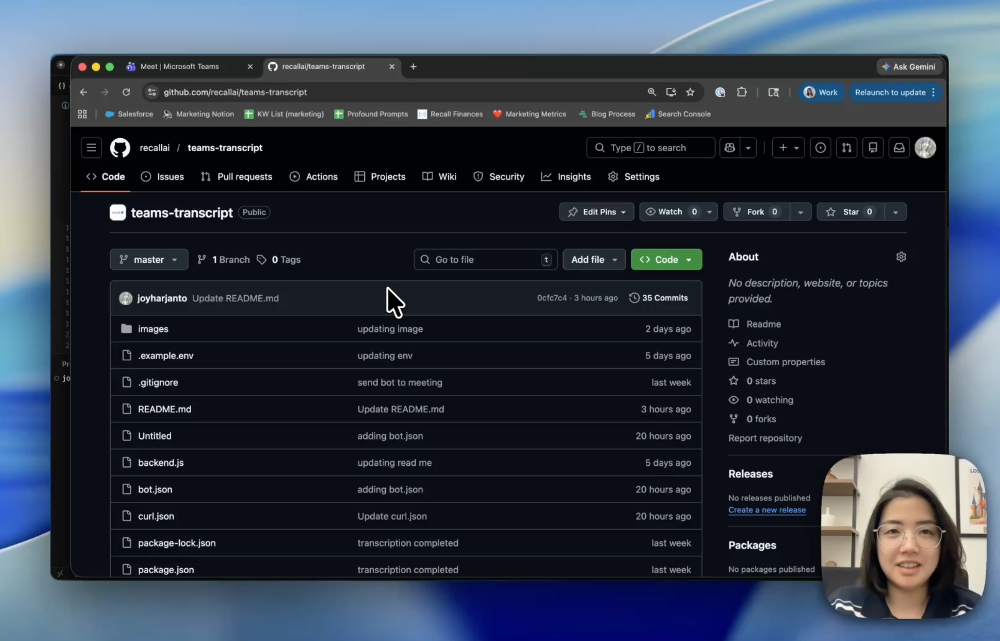
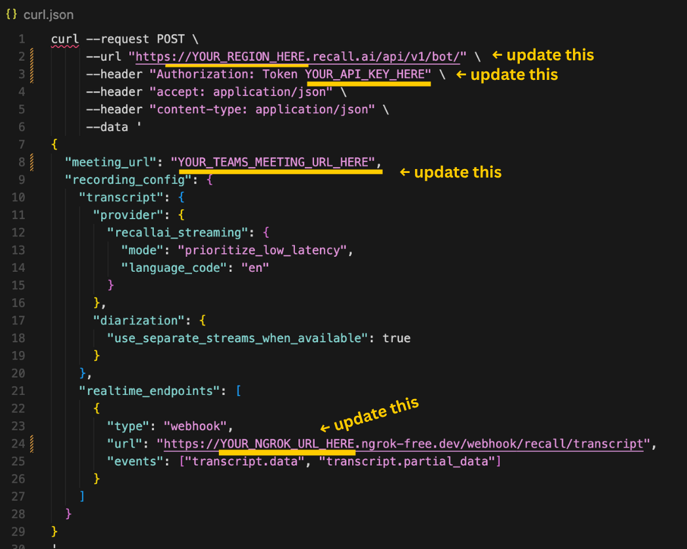

# How to get a transcript for Microsoft Teams

This repository demonstrates how to retrieve transcripts from a [Microsoft Teams](https://www.recall.ai/product/meeting-bot-api/microsoft-teams) meeting using [Recall.ai](https://www.recall.ai). To do this, you’ll need to send a bot to the meeting.

Clone the repository and follow the steps below.

Watch the video below to see the setup in action.

[](https://www.youtube.com/watch?v=J7Gwc2nVhD8&pp=0gcJCdsKAYcqIYzv)

--

# How it works

1. Send meeting bot into Microsoft Teams meeting
2. Real-time transcription begins
3. When the meeting ends, Recall.ai returns `recording.done` and async transcription can begin
4. Async transcription begins, Recall.ai returns `transcription.done` when transcript URL is ready

# Tech stack

- Recall.ai's [Meeting Bot API](https://www.recall.ai/product/meeting-bot-api)
- [Ngrok](https://www.ngrok.com)

---

# Features
- Real-time transcription
- Async transcription

**Async transcription** is generated and accessible once the meeting ends, while **real-time transcription** is generated during the meeting. 

---

# Setup

## 1. Clone the repository

```bash
git clone https://github.com/recallai/teams-transcript.git
cd teams-transcript
```

---

## 2. Create a Recall.ai account 
- Get your [Recall.ai](https://us-west-2.recall.ai/dashboard/) API key

---

## 3. Add environment variables

Rename the **.example.env** file to **.env** and replace the following

```
RECALL_API_KEY=your_recall_api_key
RECALL_REGION=your_api_base_when_you_signup
PUBLIC_BASE_URL=ngrok_link // you'll configure this in step 5
```
RECALL_API_BASE is the base URL for your Recall region and is determined when you sign up for Recall.ai

where_you_signed_up -> url -> RECALL_REGION

US West 2 -> https://www.us-west-2.recall.ai -> us-west-2

US East 1 -> https://www.us-east-1.recall.ai -> us-east-1

EU -> https://www.eu-central-1.recall.ai -> eu-central-1

Asia -> https://www.ap-northeast-1.recall.ai -> ap-northeast-1

---

## 4. Install dependencies
In your terminal, run:

```bash
npm install
```
---

## 5. Start an ngrok Tunnel

[Recall.ai](https://us-west-2.recall.ai/dashboard/) requires a **public webhook endpoint**, so we expose the backend with ngrok. 

First make sure you add the authtoken on ngrok:

```bash
ngrok config add-authtoken <token>
```

Open a new terminal in your root directory, run:

```bash
ngrok http 3000
```

You will receive a URL similar to:

```
https://abc123.ngrok-free.app // this is YOUR_NGROK_URL
```

Remember to add it to .env
```
PUBLIC_BASE_URL=ngrok_link
```

---

## 6. Set up webhooks for async transcription

Login to [Recall.ai](https://us-west-2.recall.ai/dashboard/) and it will take you to your dashboard, then configure the [webhook URL](https://docs.recall.ai/reference/webhooks-overview) under the Webhooks section.

Add the following endpoint:

```
https://YOUR_NGROK_URL/webhooks/recall
```

Example:

```
https://abc123.ngrok-free.app/webhooks/recall
```

Add events such as: 

- `recording.done`
- `transcript.done`

---
## Bonus: If you only want async transcription

Configure bot.json file

- Replace YOUR_TEAMS_MEETING_LINK with the Microsoft Teams meeting link you want to send your meeting bot to.
- Replace YOUR_REGION_HERE with your region (RECALL_REGION)
- Replace YOUR_API_KEY_HERE with your API key from Recall.ai (RECALL_API_KEY)

Run the cURL command in the terminal, a bot will appear in your Teams meeting that will start async transcription once the meeting ends.
  
---

## 7. Start real-time and async transcription

Configure curl.json file

- Replace YOUR_TEAMS_MEETING_LINK with the Microsoft Teams meeting link you want to send your meeting bot to.
- Replace YOUR_NGROK_LINK with your ngrok link (PUBLIC_BASE_URL)
- Replace YOUR_REGION_HERE with your region (RECALL_REGION)
- Replace YOUR_API_KEY_HERE with your API key from Recall.ai (RECALL_API_KEY)


---

## 8. Start your terminal

In your terminal, run: 
```
node backend.js
```

---

## 9. Run curl command to send bot to meeting and retrieve live transcription

Open a new terminal, copy everything in curl.json, and run the curl command in the terminal.

Let the bot into the meeting. Both real-time and async transcription are now available to you.


